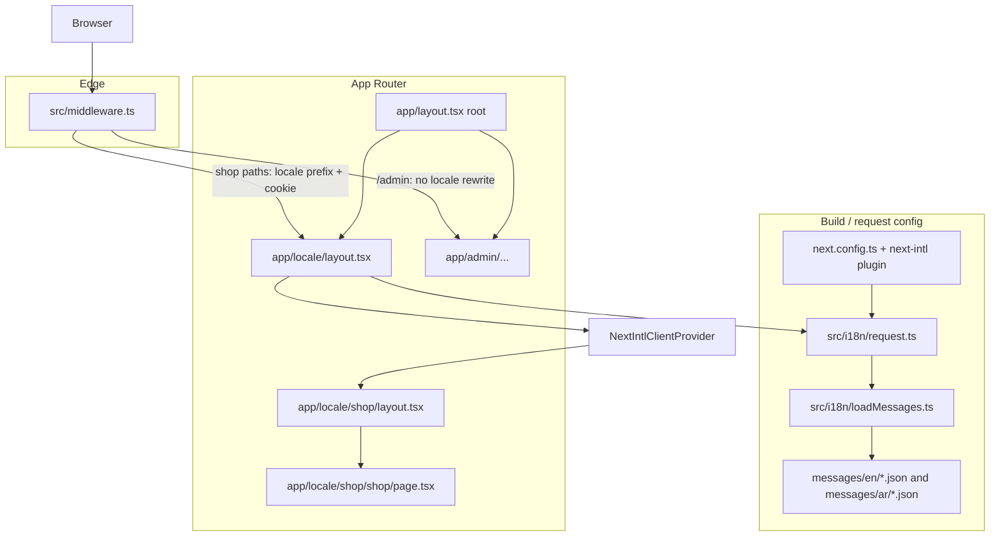

# Phase 1 — Shop internationalization (i18n) with next-intl

This document describes everything implemented for **locale-based routing**, **structured translations**, and **middleware** for the customer shop. The **admin panel** stays **English-only** and is **not** wrapped by the i18n provider or locale URL segment.

**Dependency:** `next-intl` (see `package.json`).

---

## Goals (recap)

| Area | Behavior |
|------|----------|
| **Shop** | English and Arabic; URLs always include locale (`/en/...`, `/ar/...`); messages loaded per request; RTL for Arabic in the shop shell. |
| **Admin** | Routes like `/admin/dashboard` with **no** `[locale]` prefix; middleware does not apply next-intl rewrites to `/admin`. |
| **Persistence** | next-intl middleware negotiates locale (cookie + URL); language follows the path the user bookmarked or switched to. |
| **Scalability** | Translations split into **namespaced JSON** files under `messages/{locale}/`; adding features = new JSON namespace + loader entry. |

---

## Architecture (request flow)



1. **`next.config.ts`** loads the **next-intl plugin**, which connects **`src/i18n/request.ts`** to every request that uses next-intl APIs.
2. **`src/middleware.ts`** runs on matching paths and applies **next-intl’s locale routing** (redirects, prefix, cookie). **`/admin`** is excluded from the matcher so admin URLs are unchanged.
3. For **`/[locale]/...`** routes, **`src/i18n/request.ts`** resolves the active **`requestLocale`**, validates it with **`routing.locales`**, and returns **`messages`** from **`loadMessages(locale)`**.
4. **`app/[locale]/layout.tsx`** validates the `[locale]` segment, calls **`setRequestLocale`** (for static rendering compatibility), fetches messages with **`getMessages()`**, and wraps children in **`NextIntlClientProvider`** so client components can call **`useTranslations`**.
5. **`app/[locale]/(shop)/layout.tsx`** sets **`dir`** and **`lang`** on a wrapper using **`getDirection`** from **`src/shared/utils/rtl.ts`**.
6. **Admin** routes never enter the `[locale]` layout tree, so they never receive **`NextIntlClientProvider`** or shop messages (admin copy can stay plain English strings).

---

## URL map

| URL | Purpose |
|-----|---------|
| `/` | Handled by middleware → redirects toward **default locale** (`en`), then see below. |
| `/en`, `/ar` | **`app/[locale]/page.tsx`** immediately **`redirect`**s to **`/shop`** for that locale → **`/en/shop`**, **`/ar/shop`**. |
| `/en/shop`, `/ar/shop` | Shop home; **`app/[locale]/(shop)/shop/page.tsx`**. |
| `/admin/dashboard`, … | Admin; **no** locale in path. |

**Route group `(shop)`** does not appear in the URL; only the **`shop`** segment does.

---

## New / touched files (inventory)

### Core i18n configuration (`src/i18n/`)

| File | Role |
|------|------|
| **`routing.ts`** | **`defineRouting`**: `locales: ['en','ar']`, `defaultLocale: 'en'`, **`localePrefix: 'always'`** so every localized URL shows the locale. Exports **`AppLocale`** type. |
| **`navigation.ts`** | **`createNavigation(routing)`** → **`Link`**, **`redirect`**, **`usePathname`**, **`useRouter`**, **`getPathname`**. Use these in the **shop** for navigation so the active locale is preserved (avoid raw `next/link` for internal shop links). |
| **`request.ts`** | **`getRequestConfig`** (next-intl server entry): reads **`requestLocale`**, validates with **`hasLocale`**, falls back to **`defaultLocale`**, returns **`{ locale, messages }`** via **`loadMessages`**. |
| **`loadMessages.ts`** | Dynamically **`import()`**s each namespace JSON under **`messages/{locale}/`**, merges into one object: `{ nav, hero, home, listing, product, cart, contact, footer, common }`. **Adding a namespace** = new JSON files + add the name to the **`namespaces`** array. |
| **`messages.ts`** | Imports **English** JSON files to build **`enMessages`** and type **`AppMessages`**. Used for **TypeScript** alignment with **`IntlMessages`** (see `src/global.d.ts`). Arabic must keep the **same key shape** per namespace. |

### Edge / build

| File | Role |
|------|------|
| **`src/middleware.ts`** | **`createMiddleware(routing)`**. **`matcher`** skips `api`, `_next`, `_vercel`, **`admin`**, `favicon.ico`, and paths with a file extension (e.g. `.ico`). So **`/admin/*`** is **not** rewritten to **`/en/admin/...`**. |
| **`next.config.ts`** | Wrapped with **`createNextIntlPlugin('./src/i18n/request.ts')`**. |

### Types

| File | Role |
|------|------|
| **`src/global.d.ts`** | Declares **`interface IntlMessages extends AppMessages`** so **`useTranslations('nav')('home')`** keys are typed against the English message tree. |

### App Router — localized segment

| File | Role |
|------|------|
| **`src/app/[locale]/layout.tsx`** | Validates **`locale`**; **`notFound()`** if invalid. **`generateStaticParams`** for **`en`** and **`ar`**. **`setRequestLocale`**, **`getMessages()`**, **`NextIntlClientProvider`**. |
| **`src/app/[locale]/page.tsx`** | **`redirect({ href: '/shop', locale })** so **`/en`** → **`/en/shop`**, **`/ar`** → **`/ar/shop`**. Uses **`redirect`** from **`@/i18n/navigation`**. |
| **`src/app/[locale]/(shop)/layout.tsx`** | Shop shell: **`setRequestLocale`**, **`dir`**, **`lang`**, **`data-silo="shop"`**. |
| **`src/app/[locale]/(shop)/shop/page.tsx`** | Shop home page; **`setRequestLocale`**; renders **`HomeView`**. |

### Root layout (shared with admin)

| File | Role |
|------|------|
| **`src/app/layout.tsx`** | Root **`<html>`** / **`<body>`**, fonts, **`globals.css`**. **`suppressHydrationWarning`** on **`<html>`** because document `lang` may differ from the shop subtree’s **`lang`**. **`NextIntlClientProvider`** is **only** under **`[locale]`**, not here — so **admin** does not require message JSON. |

### Shop UI example

| File | Role |
|------|------|
| **`src/shop/views/HomeView.tsx`** | Client component: **`useTranslations('common')`**, **`useTranslations('nav')`**, **`useLocale`**, **`Link`** + **`usePathname`** from **`@/i18n/navigation`** for EN/AR switch while staying on the same path (e.g. **`/shop`**). |

### Translation assets (repo root)

| Path | Role |
|------|------|
| **`messages/en/*.json`** | English strings per namespace (see table below). |
| **`messages/ar/*.json`** | Arabic strings; **same keys** as English per file. |

**Namespaces (9 files per locale):**

| File | Typical content (examples) |
|------|----------------------------|
| **`nav.json`** | `brand`, `home`, `products`, `cart`, `language`, … |
| **`hero.json`** | Hero search UI: `heroTitle`, `heroMake`, `heroFindParts`, … |
| **`home.json`** | Home sections: `shopByBrandTitle`, `bestSellersTitle`, `whatsappHelpCta`, … |
| **`listing.json`** | PLP/filters: `listingTitle`, `listingFilters`, `listingSortBy`, … |
| **`product.json`** | PDP: `productDetailDescription`, `productDetailSku`, … |
| **`cart.json`** | Cart: `cartPageHeading`, `cartEmptyTitle`, … |
| **`contact.json`** | Contact page: `contactPageTitle`, … |
| **`footer.json`** | Footer + stats: `footerCopyright`, `companyStatParts`, … |
| **`common.json`** | Dev/starter hints in `HomeView`: `starterShellHint`, `starterFileShopPage`, … |

**ICU / interpolation:** Cart plural-style strings use **`{n}`** (next-intl / ICU), e.g. **`cartCountParenMany`**: `({n} items)` — not `{{n}}`.

**Source of copy:** Text was ported from the design prototype **`CarSparePartsDesign/src/shop/i18n/shopNavStrings.ts`**, split by namespace.

### Shared utility (pre-existing, used by i18n)

| File | Role |
|------|------|
| **`src/shared/utils/rtl.ts`** | **`getDirection(locale)`** → **`'ltr'`** or **`'rtl'`** (`ar` → RTL). |

### ESLint (silo rules)

| File | Change |
|------|--------|
| **`eslint.config.mjs`** | Shop import restrictions apply to **`src/app/[locale]/(shop)/**/*`** (not the old **`src/app/(shop)`** path). |

### Removed during i18n work

| Path | Reason |
|------|--------|
| **`src/shared/i18n/en.json`**, **`ar.json`** | Placeholders replaced by **`messages/`** namespaces. |
| **`src/app/(shop)/`** | Replaced by **`src/app/[locale]/(shop)/`**. |

---

## How to use translations in code

### Server Components (under `[locale]`)

```ts
import { getTranslations } from "next-intl/server";

const t = await getTranslations("nav");
t("home");
```

### Client Components (under `[locale]`, inside provider)

```ts
"use client";
import { useTranslations } from "next-intl";

const t = useTranslations("hero");
t("heroTitle");
```

### Navigation (shop only)

```tsx
import { Link } from "@/i18n/navigation";

<Link href="/shop" locale="ar">العربية</Link>
```

---

## Admin vs shop (important)

- **Admin** lives at **`src/app/(admin)/admin/...`** and is **outside** **`app/[locale]`**.
- **Middleware** does not run next-intl matching for **`/admin`**, so no locale prefix is injected.
- **Product fields** like **`name_ar`** / **`name_en`** coming from the **database** are **data**, not **next-intl** message files — you render whatever the API returns; that is separate from UI string translation.

---

## Extending the system

1. **New keys:** Edit **`messages/en/{namespace}.json`** and **`messages/ar/{namespace}.json`** with the same keys.
2. **New namespace:** Add **`messages/en/foo.json`** and **`messages/ar/foo.json`**, add **`"foo"`** to **`namespaces`** in **`loadMessages.ts`**, import the English file in **`messages.ts`** and add **`foo`** to **`enMessages`** so types stay in sync.
3. **New shop route:** Add pages under **`src/app/[locale]/(shop)/...`**, use **`setRequestLocale`** where next-intl recommends for static rendering, and use **`Link`** from **`@/i18n/navigation`**.

---

## Verification commands

- **`npm run lint`**
- **`npx next build`** (non-Turbopack recommended if Turbopack fails locally on some setups)

Expected routes after build include **`/[locale]`**, **`/[locale]/shop`**, and **`/admin/dashboard`**.

---

## Design decisions (short)

- **`messages/` at repo root:** Matches common **next-intl** examples; **`loadMessages`** resolves **`../../messages/`** from **`src/i18n/`**. You can move catalogs under **`src/i18n/messages/`** later if you prefer colocation (update imports only).
- **Shop home at `/[locale]/shop`:** Matches the product requirement for a literal **`shop`** segment after the locale.
- **Root `lang="en"`:** The **shop** subtree sets **`lang`** and **`dir`** on a wrapper; fixing **`<html lang>`** per locale globally would require a different root layout strategy or a small client sync — noted as a possible follow-up in the original plan.
