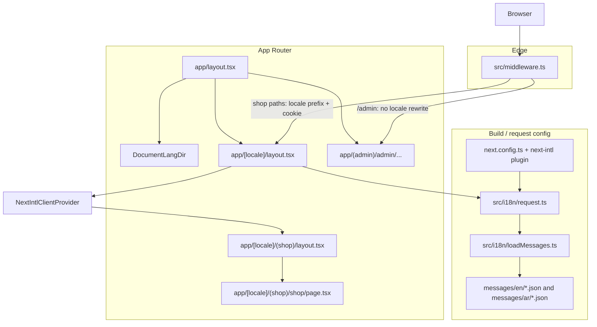

# Phase F1 — Shop i18n (next-intl) and RTL / document foundation

This document covers **locale-based routing**, **structured translations**, **middleware**, and **document-level `lang` / `dir`**, **Arabic-capable fonts**, and the **placeholder `ShopLocaleToggle`**. The **admin panel** stays **English-only** and is **not** wrapped by the i18n provider or locale URL segment.

**Dependency:** `next-intl` (see `package.json`).

---

## Goals

| Area | Behavior |
|------|----------|
| **Shop** | English and Arabic; URLs always include locale (`/en/...`, `/ar/...`); messages loaded per request; RTL for Arabic in the shop shell and on **`<html>`** via `DocumentLangDir`. |
| **Admin** | Routes like `/admin/dashboard` with **no** `[locale]` prefix; middleware does not apply next-intl rewrites to `/admin`; **`document.documentElement`** resets to **English LTR** on admin paths. |
| **Persistence** | next-intl middleware negotiates locale (cookie + URL); language follows the path the user bookmarked or switched to. |
| **Scalability** | Translations split into **namespaced JSON** files under `messages/{locale}/`; adding features = new JSON namespace + loader entry. |
| **Typography** | Geist for Latin + **Noto Sans Arabic** in the sans stack for correct Arabic glyphs. |

---

## Architecture (request flow)



1. **`next.config.ts`** loads the **next-intl plugin**, which connects **`src/i18n/request.ts`** to every request that uses next-intl APIs.
2. **`src/middleware.ts`** runs on matching paths and applies **next-intl’s locale routing** (redirects, prefix, cookie). **`/admin`** is excluded from the matcher so admin URLs are unchanged.
3. For **`/[locale]/...`** routes, **`src/i18n/request.ts`** resolves the active **`requestLocale`**, validates it with **`routing.locales`**, and returns **`messages`** from **`loadMessages(locale)`**.
4. **`app/[locale]/layout.tsx`** validates the `[locale]` segment, calls **`setRequestLocale`**, **`getMessages()`**, and wraps children in **`NextIntlClientProvider`**.
5. **`app/layout.tsx`** loads **Geist**, **Geist Mono**, and **Noto Sans Arabic**; renders **`DocumentLangDir`** so **`document.documentElement.lang`** and **`.dir`** match **`/en/...`** or **`/ar/...`**, or reset to **en/ltr** for admin and other non-shop paths.
6. **`app/[locale]/(shop)/layout.tsx`** sets **`dir`** and **`lang`** on a shop wrapper using **`getDirection`** from **`src/shared/utils/rtl.ts`** (bidi context for descendants).
7. **Admin** never enters the `[locale]` layout tree, so it never receives **`NextIntlClientProvider`** or shop messages.

---

## URL map

| URL | Purpose |
|-----|---------|
| `/` | Middleware → default locale, then **`/en`** → redirect to **`/en/shop`**. |
| `/en`, `/ar` | **`app/[locale]/page.tsx`** **`redirect`**s to **`/shop`** → **`/en/shop`**, **`/ar/shop`**. |
| `/en/shop`, `/ar/shop` | Shop home; **`app/[locale]/(shop)/shop/page.tsx`**. |
| `/admin/dashboard`, … | Admin; **no** locale in path. |

**Route group `(shop)`** does not appear in the URL; only the **`shop`** segment does.

---

## File inventory

### Core i18n (`src/i18n/`)

| File | Role |
|------|------|
| **`routing.ts`** | **`defineRouting`**: `locales: ['en','ar']`, `defaultLocale: 'en'`, **`localePrefix: 'always'`**. Exports **`AppLocale`**. |
| **`navigation.ts`** | **`createNavigation(routing)`** → **`Link`**, **`redirect`**, **`usePathname`**, **`useRouter`**, **`getPathname`**. Use in the **shop** for internal links. |
| **`request.ts`** | **`getRequestConfig`**: **`requestLocale`**, **`hasLocale`**, **`loadMessages`**. |
| **`loadMessages.ts`** | Dynamic **`import()`** of namespace JSON under **`messages/{locale}/`**. |
| **`messages.ts`** | English JSON imports → **`enMessages`**, **`AppMessages`** type for **`IntlMessages`**. |

### Edge / build

| File | Role |
|------|------|
| **`src/middleware.ts`** | **`createMiddleware(routing)`**; matcher skips `api`, `_next`, `_vercel`, **`admin`**, `favicon.ico`, dotted static paths. |
| **`next.config.ts`** | **`createNextIntlPlugin('./src/i18n/request.ts')`**. |

### Document locale & RTL helpers (`src/shared/`)

| File | Role |
|------|------|
| **`shared/ui/DocumentLangDir.tsx`** | Client: **`usePathname`** + **`useEffect`** → **`document.documentElement.lang` / `.dir`**. |
| **`shared/utils/documentLocaleFromPathname.ts`** | Parses **`/en/...`** / **`/ar/...`**; else **en** + **ltr**. |
| **`shared/utils/rtl.ts`** | **`getDirection(locale)`** → **`ltr`** / **`rtl`**. |
| **`shared/utils/index.ts`** | Re-exports RTL + document locale helpers. |

### Types

| File | Role |
|------|------|
| **`src/global.d.ts`** | **`IntlMessages extends AppMessages`** for typed **`t(...)`**. |

### App Router — localized segment

| File | Role |
|------|------|
| **`src/app/[locale]/layout.tsx`** | Locale guard, **`generateStaticParams`**, **`setRequestLocale`**, **`getMessages`**, **`NextIntlClientProvider`**. |
| **`src/app/[locale]/page.tsx`** | **`redirect({ href: '/shop', locale })`**. |
| **`src/app/[locale]/(shop)/layout.tsx`** | Shop wrapper: **`dir`**, **`lang`**, **`data-silo="shop"`**. |
| **`src/app/[locale]/(shop)/shop/page.tsx`** | Shop home; **`HomeView`**. |

### Root layout (shop + admin)

| File | Role |
|------|------|
| **`src/app/layout.tsx`** | **`<html suppressHydrationWarning>`**, fonts (**Geist**, **Geist Mono**, **Noto Sans Arabic**), **`DocumentLangDir`**, **`globals.css`**. **`NextIntlClientProvider`** stays only under **`[locale]`**. |

### Shop UI

| File | Role |
|------|------|
| **`src/shop/components/ShopLocaleToggle.tsx`** | Placeholder EN/AR switcher (**`Link`** from **`@/i18n/navigation`**). **`className`** for layout; swap visuals when nav/footer design exists. **`data-component="shop-locale-toggle"`**. |
| **`src/shop/views/HomeView.tsx`** | Uses **`ShopLocaleToggle`** (e.g. near brand and in footer area) + **`useTranslations`**. |

### Styles

| File | Role |
|------|------|
| **`src/app/globals.css`** | Theme tokens; **`--font-sans`** = Geist → **Noto Arabic** → system UI. |

### Translation assets (repo root)

| Path | Role |
|------|------|
| **`messages/en/*.json`**, **`messages/ar/*.json`** | Namespaces: **`nav`**, **`hero`**, **`home`**, **`listing`**, **`product`**, **`cart`**, **`contact`**, **`footer`**, **`common`**. Same keys per locale. |

**ICU:** use **`{n}`** in strings (e.g. cart counts), not **`{{n}}`**.

**Copy source:** Design repo **`CarSparePartsDesign/src/shop/i18n/shopNavStrings.ts`**, split by namespace.

### ESLint

| File | Role |
|------|------|
| **`eslint.config.mjs`** | Shop silo: **`src/app/[locale]/(shop)/**/*`**. |

### Removed earlier in i18n work

| Path | Reason |
|------|--------|
| **`src/shared/i18n/en.json`**, **`ar.json`** | Replaced by **`messages/`**. |
| **`src/app/(shop)/`** | Replaced by **`src/app/[locale]/(shop)/`**. |

---

## RTL / LTR styling conventions (future pages)

1. Prefer **logical** spacing: **`ms-` / `me-` / `ps-` / `pe-`** (or **start/end**) instead of **`ml` / `mr` / `pl` / `pr`** when mirroring matters.
2. Use **`rtl:`** only for intentional asymmetry.
3. **Shop wrapper** + **`<html>`** both reflect direction: wrapper for subtree bidi; **`DocumentLangDir`** for document-level a11y and consistency with the URL.

---

## Navbar / footer (deferred)

Dedicated **ShopHeader** / **ShopFooter** are **not** implemented. When your design is ready, reuse **`ShopLocaleToggle`** (or replace it) in those shells and remove duplicate toggles from pages like **`HomeView`**.

---

## How to use translations in code

### Server Components (under `[locale]`)

```ts
import { getTranslations } from "next-intl/server";

const t = await getTranslations("nav");
t("home");
```

### Client Components (under `[locale]`, inside provider)

```ts
"use client";
import { useTranslations } from "next-intl";

const t = useTranslations("hero");
t("heroTitle");
```

### Navigation (shop only)

```tsx
import { Link } from "@/i18n/navigation";

<Link href="/shop" locale="ar">العربية</Link>
```

---

## Admin vs shop

- **Admin** is **`src/app/(admin)/admin/...`**, outside **`app/[locale]`**.
- **Middleware** does not locale-prefix **`/admin`**.
- **DB fields** like **`name_ar`** / **`name_en`** are **content**, not **`messages/*.json`**.

---

## Extending the system

1. **New keys:** Edit **`messages/en/{namespace}.json`** and **`messages/ar/{namespace}.json`** (same keys).
2. **New namespace:** New JSON pair + add name in **`loadMessages.ts`** + import in **`messages.ts`** for types.
3. **New shop route:** Under **`src/app/[locale]/(shop)/...`**, use **`setRequestLocale`** as needed and **`Link`** from **`@/i18n/navigation`**.

---

## Verification

- **`npm run lint`**
- **`npx next build`**

Smoke-test: **`/en/shop`**, **`/ar/shop`** (RTL + Arabic font), **`/admin/dashboard`** (`html` **en** + **ltr** after visiting shop).

---

## Design decisions

- **`messages/` at repo root:** Matches common next-intl layouts; **`loadMessages`** uses **`../../messages/`** from **`src/i18n/`**. Can move under **`src`** later with import updates only.
- **Shop home at `/[locale]/shop`:** Literal **`shop`** segment after locale.
- **`DocumentLangDir`:** Client sync of **`<html lang dir>`** avoids splitting **`<html>`** between admin and shop while keeping correct document metadata on shop URLs.
- **`ShopLocaleToggle`:** Functional placeholder; visual design TBD with nav/footer.
